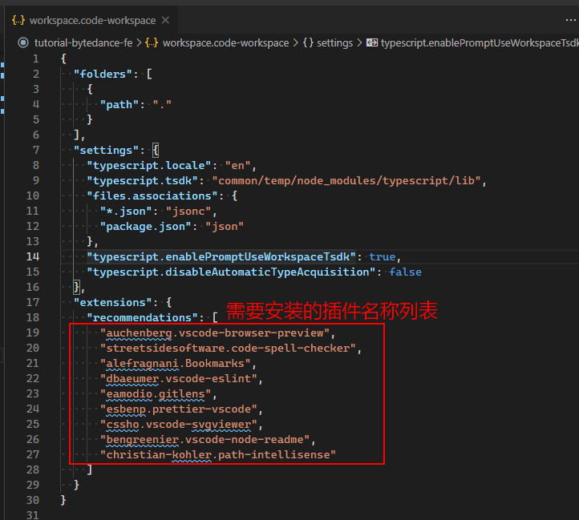
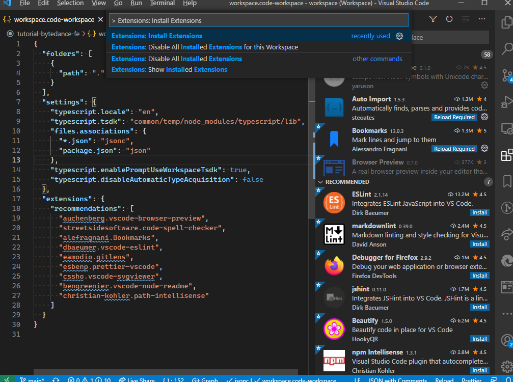

# 使用说明

## Step 1 安装 pnpm、rush、eslint 等工具

```shell
npm i pnpm -g  # 安装 pnpm
pnpm install -g @microsoft/rush eslint  # 用 pnpm 安装 eslint、rush
```

## Step 2 clone 项目并安装依赖

```shell
# clone 项目会在命令行所在路径生成 tutorial-bytedance-fe 的目录
git clone https://github.com/LPegasus/tutorial-bytedance-fe

# cd 到项目目录下
cd tutorial-bytedance-fe

# 安装依赖
rush update
```

## Step 3 安装 vscode 插件

使用 vscode 打开 workspace.code-workspace 文件

根据右下角提示安装插件，若没有弹出提示，需要手动安装插件。

手动安装插件方法见 Q & A

# 开发指南

## 目录结构说明

### `/apps`

存放所有应用代码。在这里会有一些课程示例。

> 所谓 **应用** 就是需要打包部署的代码，区别于 **公共模块**，应用中的代码不会有任何到处，给其他模块引入使用。

### `/libraries`

存放所有 **公共模块** 代码，**公共模块** 是不同应用公用的代码。这部分代码不需要打包部署。

1. `/libraries/utility` 工具类代码存放处
2. `/react-components` 公共 react 组件

以下无需两个目录无需关注

1. `/libraries/eslint-config` 定义了 eslint 工具的配置
2. `/libraries/configs` 存放一些配置文件

### `/.vscode`

存放 vscode 配置文件

1. `/.vscode/extensions.json`
   需要安装的 vscode 插件

2. `/.vscode/settings.json`
   一些插件配置
3. `/.vscode/snippets.json.code-snippets`
   代码片段配置

## 如何添加项目

### STEP 1

在 apps 或者 libraries（取决于是 **应用** 还是 **公共模块**）目录下创建项目目录

### STEP 2

运行 npm init

```shell
npm init
```

### STEP 3

在 `/rush.json` 的 `projects` 字段中添加刚刚创建的项目

```json
{
  "packageName": "<同 package.json 中的 name>",
  "projectFolder": "<项目所在目录>"
}
```

## 如何添加依赖

命令行工具 cd 到需要安装依赖的目录，运行如下命令

```shell
# 以安装 react、react-dom 为例子
rush add -p react -m -s # 因为这里要安装多个依赖，所以添加 -s（skip）参数，表示只修改 package.json 但不安装。
rush add -p react-dom -m -s
rush update # 当所有依赖都声明安装之后，执行 rush update 命令安装依赖
```

如果只安装单个依赖，可以不加 `-s` 参数

也可以手动修改 package.json，添加依赖，再运行 `rush update`

### eslint-config 配置

项目所有 eslint 配置统一通过 `package.json` 中的 `eslintConfig` 字段配置。统一继承 `@sjtu-fe/eslint-config` 包的配置。

需要在 `package.json` 中 `devDependencies` 字段声明 `@sjtu-fe/eslint-config` 的依赖。

```json
// 某个包的 package.json 文件
"devDependencies": {
  "@sjtu-fe/eslint-plugin": "workspace:*"
}
```

---

# 名词简介

## [eslint](https://eslint.org/)

eslint 是 JavaScript 代码静态检查工具，通过不同的 rule，帮助开发者统一代码风格、规避错误代码。通过 typescript-eslint 项目提供对 [TypeScript](https://www.typescriptlang.org/) 的支持

## [TypeScript](https://www.typescriptlang.org/)

JavaScript 语言的超集，由 CSharp 语言之父创造。可直观理解为带类型的 JavaScript 语言。

## MonoRepo

一种代码仓库的风格，将不同项目的代码放在同一个仓库中。与 MonoRepo 仓库风格相对的是 PolyRepo，一个项目一个仓库。这两种风格反应了处事哲学的不同。目前并不能说哪一种风格更好。但 Google、Microsoft、FaceBook 等公司都对 MonoRepo 投入了大量研发力量。

扩展阅读：

- [Monorepo：请使用它](https://medium.com/@adamhjk/monorepo-please-do-3657e08a4b70)
- [请不要使用 Monorepo！](https://medium.com/@mattklein123/monorepos-please-dont-e9a279be011b)

本项目采用 MonoRepo 方式管理

## [rush](https://rushjs.io/)

rush 是微软开发的服务于 Web 开发人员的 MonoRepo 工具

## [pnpm](https://pnpm.js.org/)

pnpm 是 npm 生态下的一种包管理工具。比较出名的还有 [yarn](https://yarnpkg.com/)。pnpm 的特点是快、隐式依赖不可用、软链复用。

# Q & A

## 如何安装 VSCode 插件

1. 打开 workspace.code-workspace 文件，找到下图红框部分配置

   

2. 打开 vscode 快捷命令输入框（Windows: `ctrl + shift + p `，Mac: `command + shift + p`）

   输入 `Extensions: install extensions`

   
   
   vscode 侧边栏会切换到插件管理面板

3. 将 1 中的插件名字在插件管理面板搜索框中搜索，并安装。有的插件需要重启 vscode 才会生效。可以全部装完之后再重启 vscode。