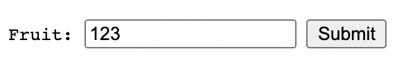
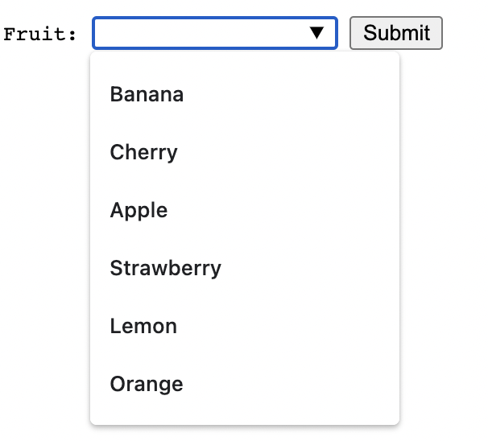
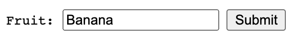

# 第一讲 课后练习

可以选择用任何方式，实现如下的效果

|*功能介绍*|*示意图*|
|---|---|
|支持自定义输入||
|支持选择||

# 提交的内容

* 截止时间：03-12 19:00（北京时间）
* 在自己的 repository 创建 `lesson-1-homework` 的文件夹，必须要有一个 `index.html` 文件可以在浏览器里面打开运行，预览效果。